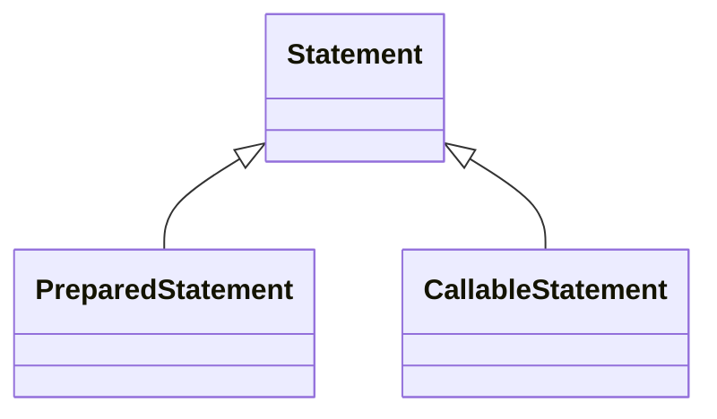

---

title: JDBC

---

JDBC has 5 key interfaces in `java.sql` package
1. Driver
2. Connection
3. PreparedStatement
4. CallableStatement
5. ResultSet

The concrete classes comes from JDBC driver as a jar file provided by each databases.

The driver jar contains implementation of these key interfaces and other interfaces

You use only interfaces and never the implementation classes directly

All JDBC classes are in the module `java.sql` and they are also in the package `java.sql`. 

When working with SQL you need `java.sql` module and import `java.sql.*` package

If you want to use JDBC with modules, remember to update your `module-info.java` file to include the following:

```java
requires java.sql;
```

otherwise, you can just use classpath while compiling or running the application

```java
javac -cp PATH_OF_DRIVER_JAR_FILE APP.java
```


JDBC URL format: `jdbc:subprotocol:subname` e.g. `jdbc:mysql://localhost:3306`


With try-with-resource while getting connection

```java
String url = "jdbc:mysql://localhost:3306";
String username = "root";
String password = "root";

Connection con = DriverManager.getConnection(url, username, password);
```

DriverManager looks through any drivers it can find to see whether they can handle the given JDBC URL
If so, it creates a `Connection` using that `Driver`


PreparedStatements



Obtain `PreparedStatement` from `Connection`

```java
try(PreparedStatement ps = conn.prepareStatement(sql)){

}
```

`sql` statement is needed while getting PreparedStatement, otherwise it will not compile.

Just creating preparedStatement does not execute the query.

Methods in PreparedStatement

|---|---|---|
| method | return type | operations |
|---|---|---|
| execute() | boolean | select, insert, update, delete |
| executeQuery() | ResultSet | select |
| executeUpdate() | int | insert, update, delete |
|---|---|---|


